<div align="center">

# ☂️ U-SIOP Terminal

### Umbrella Corporation Security-Integrated Onboarding Protocol

[](https://python.org)
[](https://langchain.com)
[](https://groq.com)
[](https://smith.langchain.com)
[](https://streamlit.io)
[](LICENSE)

---

**"Our business is life itself."**

*A security-first AI onboarding assistant with enterprise-grade access control, 
RAG-powered policy retrieval, and multi-dimensional observability.*

[Features](#-key-features) • [Architecture](#-architecture) • [Installation](#-installation) • [Documentation](#-technical-deep-dive)

</div>

---

## 📋 Overview

The **U-SIOP Terminal** is not a chatbot—it's a **security-first AI system** with conversational capabilities. Built for the fictional Umbrella Corporation, it demonstrates enterprise patterns for:

- **Role-Based Access Control (RBAC)** through Security Clearance Levels (SCL 1-5)
- **Zero-Trust Data Protection** for OMEGA-classified information
- **Dynamic RAG Retrieval** with clearance-filtered document access
- **Full Observability** via LangSmith dimensional tagging

> ⚠️ **Corporate Notice**: All interactions are monitored and logged. Unauthorized access attempts will be reviewed by the Oversight Committee.

---

## ✨ Key Features

### 🔐 SCL-Based Access Control
Multi-layered security with 5 clearance levels. Each level has specific topic permissions, restricted keywords, and retrieval limits.

### 🧠 RAG Optimization
Dynamic `k`-value selection based on clearance (SCL-1: k=2 → SCL-5: k=10). Score threshold filtering eliminates low-relevance retrievals.

### 🛡️ OMEGA-7 Privacy Guardrails
Absolute protection for salary, performance, and PII data. Triple-layer enforcement: Data masking + Code blocking + Prompt directives.

### 💾 Persistent Dossier System
SQLite-backed conversation memory with session isolation per employee. Full audit trail of all queries including security violations.

### 📊 LangSmith Observability
Dimensional tagging for security auditing: filter by SCL level, department, location. Track latency, token usage, and access patterns.

### 🎨 Industrial Neo-Corporate UI
Custom Streamlit theme with Umbrella branding, typewriter effect for transmissions, and dossier-style employee cards.

---

## 🏗️ Architecture

### System Flow

```mermaid
flowchart TD
    A[👤 User Inquiry] --> B{🔐 Security Pre-Check}
    B -->|OMEGA-7 Trigger| C[⛔ Immediate Denial]
    B -->|Location Block| D[⛔ Facility Restriction]
    B -->|SCL Block| E[⛔ Clearance Denial]
    B -->|✅ Allowed| F[📚 SCL-Filtered RAG]
    
    F --> G[k-value by SCL]
    G --> H[ChromaDB Retrieval]
    H --> I[Score Threshold Filter]
    
    I --> J[🧠 LLM Reasoning]
    J --> K[Dynamic System Prompt]
    K --> L[Llama-3.3-70B via Groq]
    
    L --> M[📡 Transmission Format]
    M --> N[Citation Injection]
    N --> O[Location Reminder]
    
    O --> P[💾 SQLite History]
    P --> Q[📊 LangSmith Trace]
    Q --> R[✅ Response to User]
    
    C --> P
    D --> P
    E --> P
```



### Security Layers

| Layer | Protection | Mechanism |
|-------|------------|-----------|
| **Layer 1** | OMEGA-7 Data | Keyword blocklist (salary, performance) |
| **Layer 2** | Location | Facility access verification |
| **Layer 3** | SCL Keywords | Role-based topic restrictions |
| **Layer 4** | LLM Prompt | Dynamic instructions per clearance |

---

## 🚀 Installation

### Prerequisites

- Python 3.10+
- Groq API key
- LangSmith API key (optional, for observability)

### Quick Start

```bash
# Clone the repository
git clone https://github.com/yourusername/u-siop-terminal.git
cd u-siop-terminal

# Create virtual environment
python -m venv venv
source venv/bin/activate  # Windows: venv\Scripts\activate

# Install dependencies
pip install -r requirements.txt

# Configure environment
cp .env.example .env
# Edit .env with your API keys
```

### Environment Variables

```env
# Required
GROQ_API_KEY=gsk_your_groq_api_key_here

# Optional: LangSmith Observability
LANGCHAIN_TRACING_V2=true
LANGCHAIN_ENDPOINT=https://api.smith.langchain.com
LANGCHAIN_API_KEY=lsv2_your_langsmith_key_here
LANGCHAIN_PROJECT=Umbrella-Corp-Onboarding
```

### Run the Application

```bash
streamlit run app.py
```

---

## 📖 Technical Deep-Dive

### Prompt Engineering

The system prompt implements **Logic Gate Architecture**—a numbered validation sequence that forces the LLM through security checks before responding:

```
### SECURITY LOGIC GATE (Internal Process)
1. Validation: Identify Asset's SCL and Location
2. Confidentiality Filter: OMEGA-7 trigger check
3. Retrieval Verification: SCL-policy match
4. Tone Alignment: Corporate-clinical language
```

**Citation Enforcement**: Every policy reference requires `[cite: XXXX]` format, reducing hallucination and enabling audit trails.

### Security Guardrails

```python
class SecurityGuardrails:
    CONFIDENTIAL_KEYWORDS = ["salary", "maaş", "performance", "performans"]
    FACILITY_KEYWORDS = ["underground", "yeraltı", "basement", "bodrum"]
    
    def check_query_permission(self, query: str) -> tuple[bool, str]:
        # Layer 1: OMEGA-7 check
        # Layer 2: Facility access check
        # Layer 3: SCL keyword check
```

**Bilingual Detection**: Keywords include both English and Turkish variants to prevent language-switching bypasses.

### LangSmith Observability

```python
langsmith_config = RunnableConfig(
    metadata={
        "employee_id": "b30c7110",
        "scl_level": 3,
        "department": "R&D",
        "location": "Umbrella Asia",
    },
    tags=["scl-3", "dept-R&D", "loc-Umbrella-Asia"]
)
```

**Security Audit Queries**:
- SCL-1 users querying research topics
- Remote employees probing HQ facilities
- Repeated OMEGA-7 violation attempts

---

## 🖥️ UI Showcase

### Dossier-Style Sidebar

- **Employee ID Card**: Full name, ID, position, department
- **SCL Badge**: Color-coded clearance indicator (Grey → Cyan → Green → Yellow → Red)
- **Security Status**: Real-time monitoring pulse effect
- **Facility Access**: Level-4 authorization indicator

### Terminal Chat Interface

- **Transmission Format**: Structured `TRANSMISSION START/END` wrapper
- **Typewriter Effect**: Character-by-character reveal simulating secure data transmission
- **Corporate Avatars**: ☂️ for AI, 👤 for user
- **JetBrains Mono**: Monospaced typography for terminal aesthetics

---

## 📁 Project Structure

```
u-siop-terminal/
├── app.py              # Streamlit entry point
├── assistant.py        # OnboardingAssistant + SecurityGuardrails
├── employees.py        # Employee data generation + SCL mapping
├── prompts.py          # System prompts + denial templates
├── ui.py               # Custom UI components + CSS injection
├── data/
│   ├── umbrella_corp_policies.pdf
│   └── vectorstore/    # ChromaDB persistence
├── .env                # API keys (not committed)
└── requirements.txt
```

---

## 📊 Quality Metrics

| Metric | Score | Details |
|--------|-------|---------|
| Security Depth | 9/10 | 4-layer Zero-Trust model |
| Code Modularity | 8/10 | Clear separation of concerns |
| Observability | 9/10 | Full LangSmith integration |
| UX Polish | 8/10 | Custom theme, animations |
| Maintainability | 8/10 | Template-based architecture |

---

## ⚠️ Compliance Notice

<div align="center">

**UMBRELLA CORPORATION CODE OF CONDUCT (UCCC)**

All employees are bound by corporate security protocols. 
Violations are subject to review by the **Oversight Committee**.

*Potential disciplinary actions include:*
- **Basement Cleaning Detail (BCD)** for minor infractions
- **Experimental Participation** for severe protocol breaches

This system logs all interactions. Unauthorized access attempts are flagged automatically.

---

**© Umbrella Corporation | "Our business is life itself."**

</div>

---

## 📄 License

This project is licensed under the MIT License - see the [LICENSE](LICENSE) file for details.

---

<div align="center">

**Built with 🔬 by the Advanced AI Division**

*Raccoon City HQ | Security Level: ALPHA*

</div>
